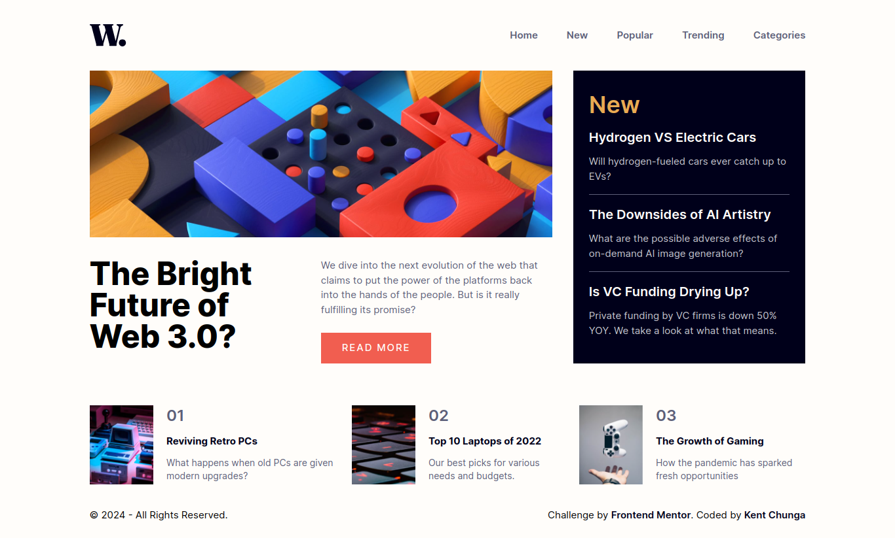

# Frontend Mentor - News homepage solution

This is a solution to the [News homepage challenge on Frontend Mentor](https://www.frontendmentor.io/challenges/news-homepage-H6SWTa1MFl). Frontend Mentor challenges help you improve your coding skills by building realistic projects.

## Table of contents

- [Overview](#overview)
  - [The challenge](#the-challenge)
  - [Screenshot](#screenshot)
  - [Links](#links)
- [My process](#my-process)
  - [Built with](#built-with)
- [Author](#author)

## Overview

### The challenge

Users should be able to:

- View the optimal layout for the interface depending on their device's screen size
- See hover and focus states for all interactive elements on the page

### Screenshot

### Links

- Solution URL: [Github Repo](https://github.com/KentChunga)
- Live Site URL: [Live preview](https://news-homepage-cfpi.onrender.com/)

## My process

### Built with

- Semantic HTML5 markup
- Flexbox
- Mobile-first workflow
- [Vite](https://vitejs.dev) - Frontend build tool
- [React](https://reactjs.org/) - JS library
- [Tailwindcss](https://tailwindcss.com/) - A utility-first CSS framework

## Author

- Frontend Mentor - [@KentChunga](https://www.frontendmentor.io/profile/KentChunga)
- Twitter - [@KentChunga](https://www.twitter.com/kentchunga)
